# 💰 FinanceOS – AI-Powered Enterprise Expense Management Platform

An intelligent expense reimbursement, policy auditing, and conversational compliance assistant powered by **FastAPI**, **React**, **Google Gemini**, **Tesseract OCR**, and **Retrieval-Augmented Generation (RAG)**, designed to provide receipt intelligence, automated compliance auditing, role-based workflows, and enterprise observability through a secure, modular backend.

---

## 📖 Table of Contents

1. [Project Overview](#-project-overview)
2. [Why FinanceOS?](#-why-financeos)
3. [Key Features](#-key-features)
4. [Technology Stack](#️-technology-stack)
5. [System Architecture](#️-system-architecture)
6. [Authentication & Authorization](#-authentication--authorization)
7. [User Workflows](#-user-workflows)
   - [Employee Workflow](#-employee-workflow)
   - [Manager Workflow](#-manager-workflow)
   - [Financial Officer Workflow](#-financial-officer-workflow)
   - [Admin Workflow](#-admin-workflow)
8. [Rule-Based Decision Engine](#-rule-based-decision-engine)
9. [AI Risk Analysis & LangGraph Workflow](#-ai-risk-analysis--langgraph-workflow)
10. [AI Query Processing & Forced Routing](#-ai-query-processing--forced-routing)
11. [Document Upload & RAG Pipeline](#-document-upload--rag-pipeline)
12. [Database Architecture](#️-database-architecture)
13. [Expense Lifecycle](#-expense-lifecycle)
14. [Project Structure](#-project-structure)
15. [API Endpoints](#-api-endpoints)
16. [Installation](#-installation)
17. [Configuration](#️-configuration)
18. [Running the Project](#-running-the-project)
19. [Performance & Observability](#-performance--observability)
20. [Testing](#-testing)
21. [Security Considerations](#-security-considerations)
22. [Design Principles](#-design-principles)
23. [Future Enhancements](#-future-enhancements)
24. [License](#-license)

---

## 📌 Project Overview

Corporate expense auditing is typically a manual, error-prone, and bottlenecked process. Managers and finance staff spend hours verifying receipt line-items, cross-checking policies, checking for duplicates, and flagging non-compliant transactions. Traditional expense software only checks hard caps, failing to detect subtle anomalies or explain *why* a particular expense is problematic.

**FinanceOS** solves this problem by combining a **deterministic Rule-Based Validation Engine** with a **Generative AI Auditing Pipeline** (powered by Google Gemini) and **RAG-based conversational compliance**. 

When an employee uploads a receipt, the system parses it using Tesseract OCR, extracts key metadata, checks for policy violations and duplicate submissions locally, and triggers Gemini to produce an explainable risk report (complete with historical comparisons, fraud scores, and actionable recommendations). Furthermore, users can chat with the integrated AI Copilot to check expense limits, query policy rules, and investigate rejected claims.

---

## 💡 Why FinanceOS?

What makes FinanceOS an enterprise-grade compliance framework:

- **Decoupled Backend Architecture** — Built using a clean service-repository pattern (`Router → Service → IRepository → MongoRepository`) ensuring strict separation of concerns, easy testing, and infrastructure independence.
- **Explainable Compliance Auditing** — Instead of a raw risk score, reviewers get structured reasoning, policy citations, extracted anomalies (like alcohol items), and suggested actions.
- **Multi-Level Compliance Filters** — A deterministic Rule Engine evaluates items (e.g., meal cap limits, economy flight tickets, rideshare receipt requirements) *before* or alongside AI inference to prevent bypass issues.
- **Provider Abstraction Model** — Built with factories for LLM and OCR operations. While **Google Gemini 2.0 Flash** and **Tesseract OCR** are the operational defaults, alternative providers (like OpenAI, Claude, Groq, Azure, or Document AI) can be configured dynamically without rewriting workflows.
- **Enterprise Observability & Request Correlation** — Implements an `X-Request-ID` correlation middleware to tie frontend user sessions, API routes, database operations, and AI logs together for instant debugging.
- **Hybrid RAG & Intent Classifier** — The AI Copilot uses string-based intent routing to bypass LLMs for simple status checks, executing direct database reads and MongoDB text searches to answer policy queries.

---

## ✨ Key Features

### 💻 Core Workspaces
- **Expense Detail Views** — Comprehensive claim dashboard showing receipt images, policy compliance flags, duplicate details, and AI recommendations.
- **Approval Timeline** — Interactive historical timeline logging state transitions and timestamps.
- **Payment Status Tracking** — Real-time reimbursement visibility for employees.

### 📄 OCR Processing
- **Receipt Image Upload** — Supports JPG, PNG, and PDF receipt uploads.
- **Automatic Text Extraction** — Leverages local Tesseract OCR engine.
- **Structured Expense Extraction** — Auto-populates vendor name, transaction date, subtotal, tax amount, and total claim amount.
- **Receipt Validation & Persistence** — Auto-saves extracted data and raw file metadata.

### ⚙️ Rule-Based Policy Validation
- **Deterministic Rules Check** — Enforces company spending limits before AI analysis.
- **Configurable Categories** — Meals, Hotels, Travel, Transportation, Receipts, Duplicate claims, and General expenses.
- **Violation Flag Output** — Returns policy status (`PASS`/`VIOLATION`), specific violations, risk score modifiers, and policy references.

### 🔎 Duplicate Detection
- **Matching Search Window** — Scans past records for identical amounts, dates, categories, and merchants.
- **Clarity Reports** — Outputs duplicate detection status, confidence scores, and reference links to existing matched claims.

### 🤖 AI-Assisted Risk Analysis
- **Decision Support Layer** — AI assists human review without replacing deterministic policy constraints.
- **Structured Risk Reports** — Returns fraud scores (0–100), AI confidence, reasoning, citations, and suggested actions.
- **Grounded Recommendations**:
  - `Very Safe` → Auto Approve Recommendation (for Fast-Track Eligible items)
  - `Low Risk` → Proceed with Workflow
  - `Medium Risk` → Manager Review Required
  - `High Risk` → Manual Investigation Required

### 💬 AI Copilot & RAG
- **Policy QA** — RAG-based query answers grounded in uploaded company policy handbooks.
- **Forced Routing** — Classifier bypasses LLM call for status/rejection queries, directing to fast database queries.

---

## 🛠 Technology Stack

- **Frontend**: React, JavaScript, HTML, CSS, Axios, Recharts (for analytics dashboard)
- **Backend**: Python, FastAPI, Pydantic, REST APIs, Motor (Async MongoDB Driver)
- **Authentication**: JWT (JSON Web Tokens), Role-Based Access Control, Bcrypt
- **AI & Agent Framework**: LangChain, LangGraph (designed routing patterns), Gemini 2.0 Flash
- **Document Intelligence**: Tesseract OCR, PIL (Python Imaging Library)
- **RAG Engine**: MongoDB Knowledge Base (Text Index Search), RRF (Reciprocal Rank Fusion)
- **Database**: MongoDB (Local or Atlas)
- **Development & Testing**: Pytest, Git, GitHub, Postman

---

## 🏗️ System Architecture

FinanceOS follows a modular service-oriented architecture, decoupling route validation, service logic, data persistence, and external AI providers.

### 📊 Conceptual Architecture Diagram
```text
                         ┌─────────────────────┐
                         │       Users         │
                         │ Employee / Manager  │
                         │ Finance / Admin     │
                         └──────────┬──────────┘
                                    │
                                    ▼
                         ┌─────────────────────┐
                         │   React Frontend    │
                         └──────────┬──────────┘
                                    │
                                    ▼
                         ┌─────────────────────┐
                         │     FastAPI API     │
                         └──────────┬──────────┘
                                    │
                         ┌──────────┴──────────┐
                         │                     │
                         ▼                     ▼
                ┌─────────────────┐   ┌─────────────────┐
                │  JWT Auth /     │   │  Role Based     │
                │  Middleware     │   │  Access Control │
                └────────┬────────┘   └────────┬────────┘
                         │                     │
                         └──────────┬──────────┘
                                    │
                                    ▼
                         ┌─────────────────────┐
                         │    Service Layer    │
                         └──────────┬──────────┘
                                    │
          ┌──────────────┬──────────┼───────────┬──────────────┐
          ▼              ▼          ▼           ▼              ▼
    ┌──────────┐   ┌──────────┐ ┌─────────┐ ┌──────────┐ ┌────────────┐
    │ Expense  │   │   OCR    │ │  Rule   │ │   AI     │ │ Approval   │
    │ Service  │   │ Service  │ │ Engine  │ │ Service  │ │ Service    │
    └────┬─────┘   └──────────┘ └────┬────┘ └────┬─────┘ └─────┬──────┘
         │                            │           │             │
         │                            ▼           ▼             ▼
         │                     ┌─────────────────────────────┐
         │                     │       MongoDB Database      │
         │                     │ Expenses / Users / Policies │
         │                     │ AI Results / Audit Logs     │
         │                     └─────────────────────────────┘
         │
         ├──────────────► Duplicate Detection
         │
         ├──────────────► RAG Pipeline
         │
         └──────────────► Analytics / Audit Logging
```

### 🧬 Logical Core Flow (Mermaid)
*Standalone code file: [system_architecture.mmd](file:///c:/Users/Pratham%20arun/source/repos/Finance/docs/mermaid_diagram/system_architecture.mmd)*
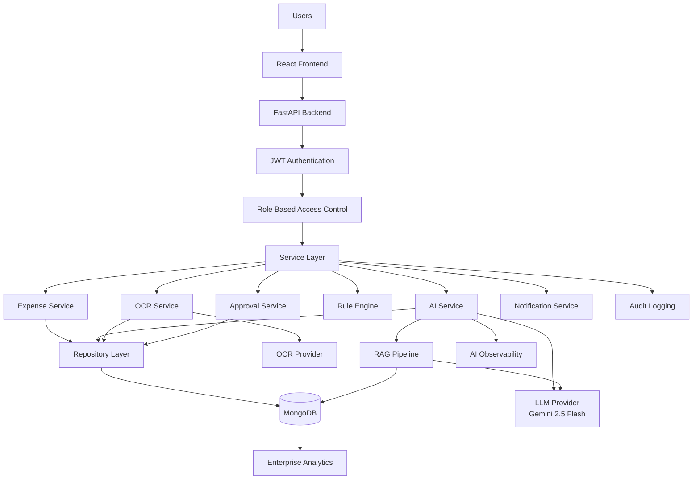

---

## 🔐 Authentication & Authorization

FinanceOS uses JWT-based authentication with role-based authorization. Every request to a protected endpoint must carry a valid access token in the `Authorization: Bearer <token>` header.

### 🔑 Authentication Pipeline
```text
User
  │
  ▼
React Frontend
  │
  ▼
FastAPI Login Endpoint
  │
  ▼
Validate Credentials
  │
  ▼
MongoDB Users
  │
  ▼
Valid User?
 ┌┴───────────────┐
 │                │
No               Yes
 │                │
 ▼                ▼
Authentication   Generate JWT
Failed              │
                    ▼
              Store Access Token
                    │
                    ▼
             Protected API Request
                    │
                    ▼
             JWT Middleware
                    │
                    ▼
                Verify JWT
                    │
                    ▼
              Get Current User
                    │
                    ▼
                Role Check
             ┌──────┼──────┬─────────┐
             ▼      ▼      ▼         ▼
          Employee Manager Finance   Admin
```

### 🔐 Token Verification Flow (Mermaid)
*Standalone code file: [auth_flow.mmd](file:///c:/Users/Pratham%20arun/source/repos/Finance/docs/mermaid_diagram/auth_flow.mmd)*
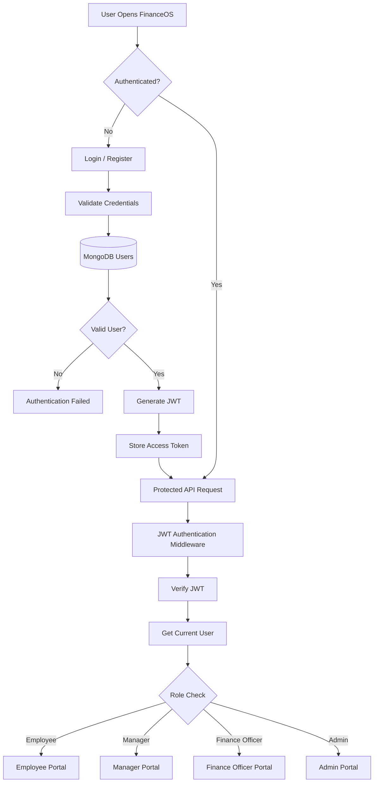

### Supported Roles:
*   `employee` — Submit claims, upload receipts, track own reimbursements.
*   `manager` — Review team submissions, evaluate risk levels, approve/reject claims.
*   `finance_officer` — Disburse payment, check audit logs, verify tax/payment configurations.
*   `admin` — Configure policies, modify AI configuration prompts, index policy files.

---

## 👤 User Workflows

### 👨‍💻 Employee Workflow

Employees submit claims and view real-time OCR and AI checks.

#### 📋 Conceptual Submission Flow
```text
Employee
   │
   ▼
Open FinanceOS
   │
   ▼
Authenticate
   │
   ▼
Employee Dashboard
   │
   ▼
Submit Expense
   │
   ├── Expense Details
   │
   └── Receipt Upload
          │
          ▼
      FastAPI API
          │
          ▼
      Expense Service
          │
          ▼
      OCR Processing
          │
          ▼
      Rule Validation
          │
          ▼
   Duplicate Detection
          │
          ▼
     AI Risk Analysis
          │
          ▼
    Expense Created
          │
          ▼
   Manager Review
```

#### 📋 Integration Sequence (Mermaid)
*Standalone code file: [employee_workflow.mmd](file:///c:/Users/Pratham%20arun/source/repos/Finance/docs/mermaid_diagram/employee_workflow.mmd)*
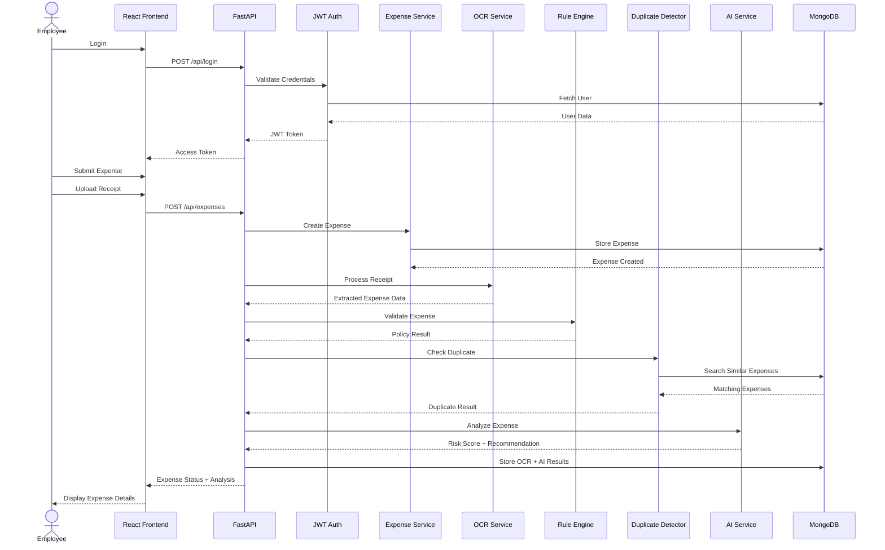

---

### 👨‍💼 Manager Workflow

Managers inspect expenses and policy violations before submitting an approval decision.

#### 📋 Conceptual Review Flow
```text
Manager
   │
   ▼
Manager Dashboard
   │
   ▼
GET /api/approvals/manager/pending
   │
   ▼
JWT + Manager Role Verification
   │
   ▼
Retrieve Pending Expenses
   │
   ▼
Review Expense
   │
   ├── Expense Details
   ├── Receipt
   ├── OCR Data
   ├── Policy Result
   ├── Duplicate Result
   └── AI Risk Analysis
          │
          ▼
     Manager Decision
       ┌────┼────┐
       ▼    ▼    ▼
    Approve Reject Clarification
       │
       ▼
 Update Approval Status
       │
       ▼
 Finance Workflow
```

#### 📋 Integration Sequence (Mermaid)
*Standalone code file: [manager_workflow.mmd](file:///c:/Users/Pratham%20arun/source/repos/Finance/docs/mermaid_diagram/manager_workflow.mmd)*
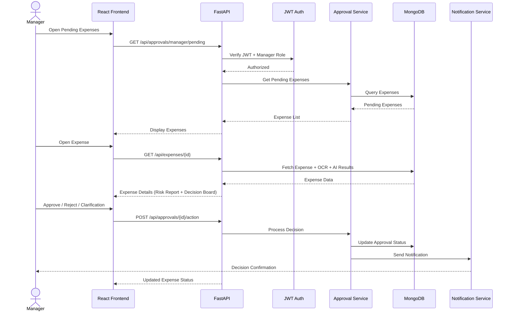

---

### 💼 Financial Officer Workflow

Finance officers verify the manager-approved claims and process payment disbursements.

#### 📋 Conceptual Payment Flow
```text
Finance Officer
      │
      ▼
Finance Dashboard
      │
      ▼
GET /api/approvals/finance/pending
      │
      ▼
JWT + Finance Role Verification
      │
      ▼
Retrieve Manager-Approved Expenses
      │
      ▼
Review Expense
      │
      ├── Expense Data
      ├── Audit History
      ├── Policy Results
      └── AI Analysis
             │
             ▼
       Finance Decision
          ┌────┴────┐
          ▼         ▼
       Approve    Reject
          │         │
          ▼         ▼
      Payment    Record
      Workflow   Rejection
          │
          ▼
     Audit Logging
```

#### 📋 Integration Sequence (Mermaid)
*Standalone code file: [finance_workflow.mmd](file:///c:/Users/Pratham%20arun/source/repos/Finance/docs/mermaid_diagram/finance_workflow.mmd)*
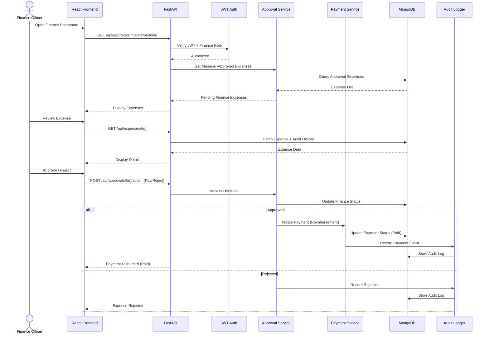

---

### 🛠️ Admin Workflow

Administrators control the operational configurations of FinanceOS.

#### 📋 Integration Sequence (Mermaid)
*Standalone code file: [admin_workflow.mmd](file:///c:/Users/Pratham%20arun/source/repos/Finance/docs/mermaid_diagram/admin_workflow.mmd)*
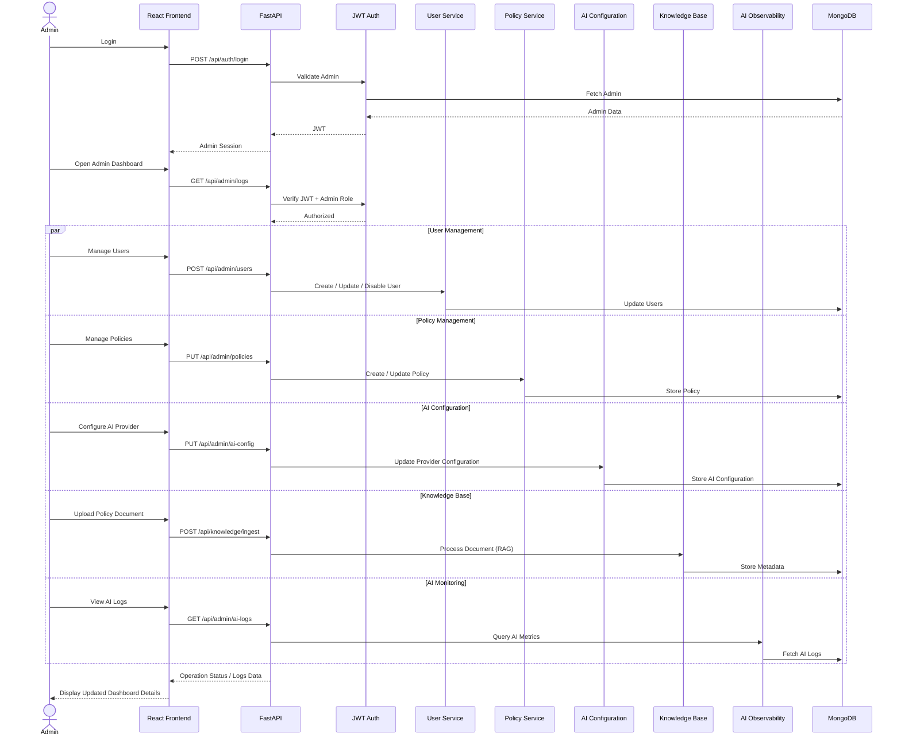

---

## ⚡ Rule-Based Decision Engine

The Rule Engine is a deterministic component responsible for enforcing explicit financial policies. 

> **Design Principle**: Deterministic policy validation happens before AI interpretation. This prevents the LLM from becoming the sole authority for financial policy decisions.

### 📋 Rule Processing Flow
```text
Incoming Expense / Query
          │
          ▼
     Validate Input
          │
          ▼
     Valid Input?
       ┌──┴──┐
       │     │
      No    Yes
       │     │
       ▼     ▼
   Reject   Rule Engine
   Request     │
               ▼
       Expense / Query Type
               │
      ┌────────┼────────────┬───────────┐
      ▼        ▼            ▼           ▼
     Meal     Hotel        Travel      Receipt
      │        │            │           │
      ▼        ▼            ▼           ▼
 Meal Rules Hotel Rules Travel Rules Receipt Rules
      │        │            │           │
      └────────┴────────────┴───────────┘
                         │
                         ▼
                 Generate Rule Result
                         │
                         ▼
                  Policy Passed?
                    ┌────┴────┐
                    ▼         ▼
                   Yes        No
                    │         │
                    ▼         ▼
             Continue       Flag
             Workflow      for Review
```

### 📋 Policy Validation Nodes (Mermaid)
*Standalone code file: [rule_engine.mmd](file:///c:/Users/Pratham%20arun/source/repos/Finance/docs/mermaid_diagram/rule_engine.mmd)*
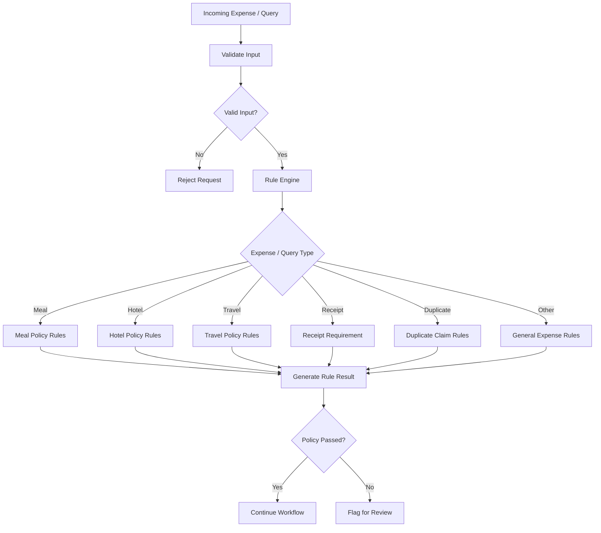

---

## 🤖 AI Risk Analysis & LangGraph Workflow

FinanceOS uses AI as an additional reasoning and helper layer after deterministic processing. The AI model output maps risk severity levels, identifies historical spending violations, and formats reasons for reviewers.

### 📋 AI Risk Processing Pipeline
```text
Validated Expense
       │
       ▼
OCR Result
       │
       ▼
Rule Engine Result
       │
       ▼
Duplicate Detection
       │
       ▼
Policy Context
       │
       ▼
LangGraph / AI Workflow
       │
       ├── Risk Analysis
       ├── Anomaly Detection
       ├── Fraud Indicators
       ├── Policy Interpretation
       └── Recommendation
       │
       ▼
AI Risk Result
       │
       ▼
Store AI Results
       │
       ▼
Manager Review
```

---

## 🧠 AI Query Processing & Forced Routing

The AI Copilot uses deterministic intent detection on incoming messages to skip LLM routing overhead for standard database queries, ensuring direct access to real application data.

### 📋 Intent Mapping Route
```text
Incoming User Message
          │
          ▼
 Intent Classifier
 String Keyword Matching
          │
     ┌────┼──────────┬──────────────┐
     ▼    ▼          ▼              ▼
Policy  Status   Rejection      Analytics
  Q&A    Query     Reason         Query
     │    │          │              │
     ▼    ▼          ▼              ▼
 RAG   Expense    Expense       Analytics
Route   Status    Rejection      Route
     │    │          │              │
     ▼    ▼          ▼              ▼
 MongoDB  DB       DB Query       Dashboard
 Knowledge Query    Query
     │    │          │              │
     └────┴──────────┴──────────────┘
                    │
                    ▼
            Format Response
                    │
                    ▼
          Grounded JSON Response
```

### 📋 Intent Classifier Logic (Mermaid)
*Standalone code file: [ai_copilot_orchestration.mmd](file:///c:/Users/Pratham%20arun/source/repos/Finance/docs/mermaid_diagram/ai_copilot_orchestration.mmd)*
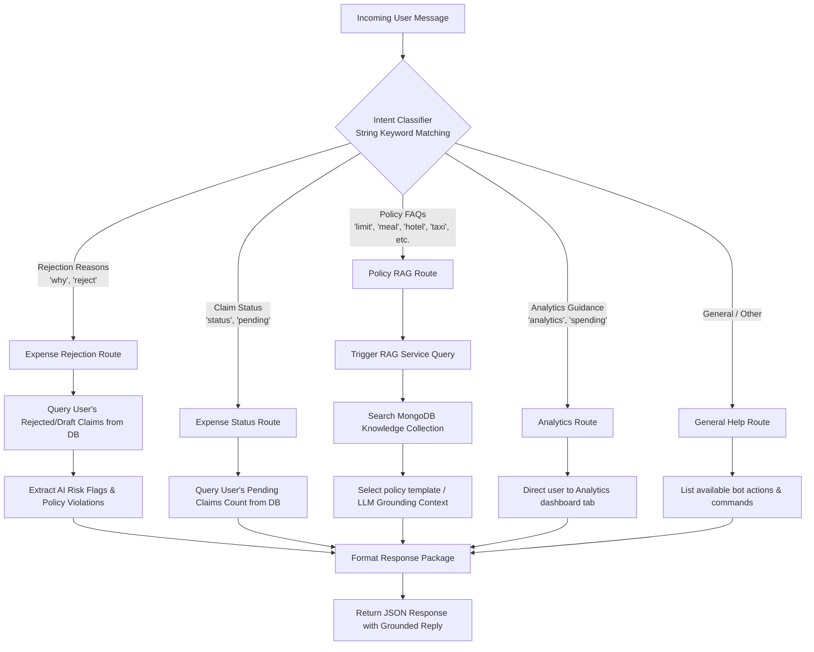

### 📋 Context Extraction & Generation (Mermaid)
*Standalone code file: [ai_query_routing.mmd](file:///c:/Users/Pratham%20arun/source/repos/Finance/docs/mermaid_diagram/ai_query_routing.mmd)*
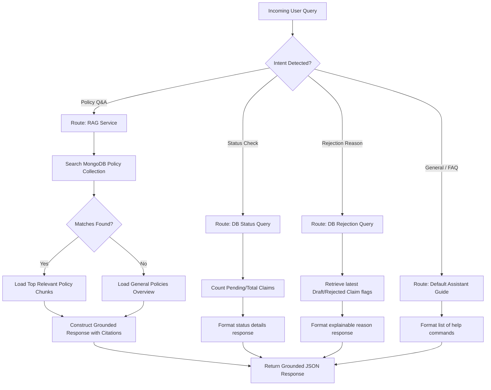

---

## 📚 Document Upload & RAG Pipeline

Admins can upload company policy documents into MongoDB. The RAG pipeline ensures that policy-related responses are grounded in these official files.

### 📋 Ingestion Flow
```text
Admin Portal
     │
     ▼
Validate File & Text
     │
     ▼
Store Document
     │
     ▼
MongoDB Knowledge Base
```

### 📋 Retrieval Flow
```text
User Policy Question
        │
        ▼
   Text Index Search
        │
        ▼
Retrieve Top Matching
    Policy Chunks
        │
        ▼
Load Grounding Context
        │
        ▼
LLM / Grounding Generator
        │
        ▼
Grounded AI Response
    with Policy Sources
```

### 📋 Pipeline Diagram (Mermaid)
*Standalone code file: [rag_pipeline.mmd](file:///c:/Users/Pratham%20arun/source/repos/Finance/docs/mermaid_diagram/rag_pipeline.mmd)*
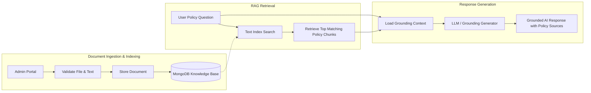

---

## 🗄️ Database Architecture

MongoDB serves as the central data store. Motor acts as the asynchronous layer connecting the FastAPI router and repositories.

```text
MongoDB
│
├── users            # Hashed user credentials, manager links, and RBAC roles
├── expenses         # Expense items, metadata, OCR text, and risk report metrics
├── policies         # Dynamic configurations for category limits and rules
├── approvals        # Approval state timeline and history logs
├── payments         # Payment confirmations and transaction references
├── knowledge_base   # Segmented policy handbook texts for RAG grounding
├── ai_results       # Cached Gemini responses and logging metrics
├── audit_logs       # Correlation records stamped with X-Request-ID
└── analytics        # Aggregated statistics for enterprise graphs
```

### Typical Expense JSON Document Structure:
```json
{
  "id": "expense_id",
  "employee_id": "user_id",
  "employee_name": "Employee",
  "title": "Hotel Stay",
  "category": "Accommodation",
  "amount": 320.00,
  "expense_date": "2026-07-20",
  "description": "Conference accommodation",
  "receipt_url": "/uploads/receipts/receipt.jpg",
  "status": "Submitted",
  "risk_score": "Medium",
  "risk_flags": [],
  "rule_engine": {},
  "duplicate_check": {},
  "ai_analysis": {},
  "timeline": [],
  "payment_reference": null,
  "created_at": "2026-07-20T09:00:00Z"
}
```

---

## 🔄 Expense Lifecycle

Each stage adds compliance details to the claim, creating an auditable review trail.

### 📋 Conceptual Lifecycle Flow
```text
Employee Submit Expense
          │
          ▼
Receipt Upload
          │
          ▼
OCR Extraction
          │
          ▼
Rule Engine Policy Validation
          │
          ▼
Duplicate Detection
          │
          ▼
AI Analysis
Risk + Recommendation
          │
          ▼
Manager Approval
          │
          ▼
Finance Officer Verification
          │
          ▼
Payment
          │
          ▼
Audit Logging
          │
          ▼
Enterprise Analytics
```

### 📋 Full Sequence Flow (Mermaid)
*Standalone code file: [expense_lifecycle.mmd](file:///c:/Users/Pratham%20arun/source/repos/Finance/docs/mermaid_diagram/expense_lifecycle.mmd)*
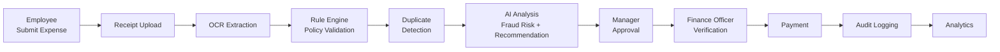

---

## 📁 Project Structure

```text
FinanceOS/
│
├── backend/                       # Python FastAPI Backend
│   ├── app.py                     # Main FastAPI application bootstrapping
│   ├── server.py                  # Core backend entrypoint wrapper
│   │
│   ├── core/                      # Global systems and middlewares
│   │   ├── config.py              # Environment configuration loader
│   │   ├── security.py            # Password hashing and JWT utilities
│   │   ├── lifespan.py            # Application lifespan (DB connections, seed data)
│   │   ├── middleware.py          # Request Correlation ID & CORS configuration
│   │   └── exceptions.py          # Custom HTTP exception Handlers
│   │
│   ├── dependencies/              # Dependency injection providers
│   │   └── auth.py                # JWT verification and user retrieval checks
│   │
│   ├── routers/                   # HTTP Route handlers
│   │   ├── auth_router.py         # Login, Registration, JWT profile retrieval
│   │   ├── expense_router.py      # Creation, upload, detail fetches, timelines
│   │   ├── approval_router.py     # Approval actions (Approve, Reject, Clarify)
│   │   ├── notification_router.py # Notification queues and read status
│   │   ├── analytics_router.py    # Enterprise financial and accuracy KPI endpoints
│   │   ├── ai_router.py           # Conversational AI Copilot chat
│   │   ├── knowledge_router.py    # Policy database search and ingestion
│   │   └── admin_router.py        # System policies, AI/OCR config dashboard
│   │
│   ├── services/                  # Business logic services
│   │   ├── auth_service.py        # Authentication logic orchestrator
│   │   ├── expense_service.py     # Expense lifecycle flows and state handlers
│   │   ├── notification_service.py# In-app notifications router
│   │   ├── analytics_service.py   # Chart aggregations and spending calculations
│   │   ├── ai_service.py          # AI Audit Prompt builder and Fallback pipeline
│   │   ├── rule_engine.py         # Deterministic policy validation engine
│   │   ├── admin_service.py       # Administration settings CRUD
│   │   ├── ocr_service.py         # OCR file validation and Tesseract wrapper
│   │   ├── chat_service.py        # AI Copilot keyword and RAG router
│   │   ├── rag_service.py         # Grounded prompt and search generator
│   │   ├── gemini_service.py      # Google Gemini 2.0 Flash integration
│   │   └── groq_service.py        # Optional Groq provider fallback
│   │
│   ├── repositories/              # DAO persistence layer (Repository Pattern)
│   │   ├── interfaces/            # Abstract base interfaces
│   │   │   └── base.py
│   │   ├── user_repository.py     # Users DB queries
│   │   ├── expense_repository.py  # Expenses DB queries
│   │   ├── policy_repository.py   # Policy limits DB queries
│   │   ├── ai_logs_repository.py  # AI logs DB queries
│   │   └── knowledge_repository.py# Grounding handbook DB queries
│   │
│   ├── schemas/                   # Pydantic validation schemas
│   ├── seed/                      # Initial seeding datasets
│   ├── tests/                     # Pytest testing suite
│   └── uploads/                   # Temporary filesystem upload store
│
├── frontend/                      # React SPA Frontend
│   ├── public/                    # Static assets
│   ├── src/                       # Application code
│   │   ├── components/            # Reusable UI parts (dashboard, risk panels)
│   │   ├── context/               # Global state (Auth, Notification Context)
│   │   ├── pages/                 # Authenticated route components
│   │   └── App.js                 # Frontend routing configuration
│   ├── package.json               # Frontend dependencies list
│   └── tailwind.config.js         # CSS configuration files
│
├── docs/                          # Project documentation
│   ├── mermaid_diagram/           # Standalone Mermaid diagrams (.mmd)
│   └── system_architecture.md     # System architecture specification
│
├── .gitignore
├── README.md                      # Project manual
└── PROJECT_STATUS.md              # Sprint status tracker
```

---

## 🔌 API Endpoints

### 🔐 Authentication
*   `POST /api/auth/register` — Register a new profile (Auto-assigns Manager id).
*   `POST /api/auth/login` — Validate credentials, return JWT access token.
*   `GET /api/auth/me` — Return current logged-in user profile metadata.

### 💵 Employee Expenses
*   `POST /api/expenses/upload` — Upload receipt image for Tesseract OCR extraction.
*   `POST /api/expenses` — Create a new expense claim. Triggers Rule Engine.
*   `GET /api/expenses` — List paginated expenses based on role permissions.
*   `GET /api/expenses/{id}` — Fetch detailed claim metadata, timeline, and AI report.
*   `PUT /api/expenses/{id}` — Update draft expense details.
*   `DELETE /api/expenses/{id}` — Delete draft or rejected claims.

### 👨‍💼 Manager Approvals
*   `GET /api/approvals/manager/pending` — List pending claims for the manager's team.
*   `POST /api/approvals/{id}/action` — Approve, Reject, or Request Clarification.

### 💼 Finance Approvals
*   `GET /api/approvals/finance/pending` — List manager-approved claims.
*   `POST /api/approvals/{id}/action` — Approve and reimburse (Paid) or Reject.

### 🛠️ Admin Configuration
*   `POST /api/admin/users` — Create a new user profile.
*   `PUT /api/admin/users` — Disable/modify user details.
*   `GET /api/admin/policies` — List active policy limits.
*   `PUT /api/admin/policies` — Update limits, receipt requirements, and categories.
*   `PUT /api/admin/ai-config` — Configure default LLM prompts and model targets.
*   `GET /api/admin/ai-config/metrics` — View statistics on LLM request counts and errors.

### 📚 Knowledge Base (RAG)
*   `POST /api/knowledge/ingest` — Index markdown or text policy documents.
*   `GET /api/knowledge/search` — Search ingested policy documents.

### 📊 AI Observability
*   `GET /api/audit/ai-logs` — Query detailed correlation logs via `X-Request-ID`.

---

## 📦 Installation

### 1. Clone the Repository
```bash
git clone https://github.com/Pratham-Arun/FinanceOS.git
cd FinanceOS
```

### 2. Create Python Environment
```bash
python -m venv .venv
```
- **Windows**: `.venv\Scripts\activate`
- **Linux / macOS**: `source .venv/bin/activate`

### 3. Install Backend Dependencies
```bash
cd backend
pip install -r requirements.txt
```

### 4. Install Frontend Dependencies
```bash
cd ../frontend
npm install
```

---

## ⚙️ Configuration

Create a `.env` file in the `backend/` directory:

```env
# MongoDB Database URI
MONGO_URI=mongodb://localhost:27017
MONGO_DB_NAME=expense_reimbursement

# JWT Authentication Secrets
JWT_SECRET=financeos_demo_jwt_secret_key_2026_secure
ACCESS_TOKEN_EXPIRE_MINUTES=1440

# LLM Config (Google Gemini defaults)
GEMINI_API_KEY=your_gemini_api_key_here
GEMINI_MODEL=gemini-2.0-flash

# OCR Engine Path (Required if Tesseract is not in system PATH)
TESSERACT_CMD=C:\Program Files\Tesseract-OCR\tesseract.exe
```

Add these standard exclusions to your global `.gitignore`:
```text
.env
.venv/
__pycache__/
node_modules/
uploads/
```

---

## ▶️ Running the Project

### 1. Start MongoDB
Ensure MongoDB is running locally (`mongodb://localhost:27017`) or configure an Atlas URI in your `.env`.

### 2. Start FastAPI Backend
From the `backend/` directory:
```bash
uvicorn server:app --reload
```
The API docs will be available at: `http://localhost:8000/docs`

### 3. Start React Frontend
From the `frontend/` directory:
```bash
npm start
```
The application workspace will load at: `http://localhost:3000`

---

## 👤 Demo Seed Accounts

The application automatically seeds the following credentials on startup:

| Role | Email | Password |
|---|---|---|
| **Admin** | `admin@demo.com` | `admin123` |
| **Employee** | `employee@demo.com` | `demo1234` |
| **Manager** | `manager@demo.com` | `demo1234` |
| **Finance Officer** | `finance@demo.com` | `demo1234` |

---

## 📊 Performance & Observability

FinanceOS captures request correlation metrics across every module using custom FastAPI logger utilities.

- **AI Metrics Captured**: LLM request counts, response latency, average model token usage, and API errors.
- **OCR Metrics Captured**: document type counts, average processing time, and character detection confidence.
- **Expense Metrics**: pending, approved, and rejected statistics, monthly spend forecasting, and policy violation distributions.

---

## 🧪 Testing

FinanceOS uses automated unit and integration tests written in pytest.

Run tests:
```bash
cd backend
pytest
```

Verbose mode:
```bash
pytest -v
```

Testing areas covered:
1. **Authentication**: login tokens, role-based validations, profile retrieval.
2. **Expense Processing**: uploads, OCR mock mappings, validation results.
3. **Approval Workflows**: Manager and Finance Officer status updates.
4. **Admin settings**: policy limit modifications and AI log querying.

---

## 🔒 Security Considerations

- **JWT Authentication**: Secure stateless access tokens with configurable lifetime.
- **RBAC Validation**: Multi-level middleware verifying email identity and permissions.
- **Secrets Isolation**: API credentials are loaded from `.env` and kept out of Git repositories.
- **Input & File Guards**: Client and server-side checks restricting files to standard images/PDFs (<5MB).
- **Correlation Stamping**: Uses `X-Request-ID` headers to prevent cross-tenant trace leaking in logs.

---

## 🧩 Design Principles

1. **Deterministic Before Generative**
   Policy rules are checked first. The AI serves as an assistant rather than the primary policy checker.
2. **AI as Decision Support**
   AI generates fraud indicators and risk estimates, but humans retain the authority to approve, reject, or request clarification.
3. **Role Isolation**
   Workflows are strictly partitioned to keep roles isolated (Employee submission, Manager operational check, Finance verification, Admin settings).
4. **Auditable Decisions**
   Decisions are recorded on the expense timeline so claims can be audited back to their raw receipts, rule outputs, and AI logs.

---

## 🔮 Future Enhancements

- **Containerization**: Add Docker-compose files for local development and cloud staging.
- **Email Notifications**: Notify users when expenses are approved, rejected, or paid.
- **ERP Integration**: Automatically sync paid claims with corporate accounting platforms (like SAP or NetSuite).
- **Advanced Anomaly Models**: Integrate ML models for duplicate invoice detection.

---

## 📄 License

This project is developed for educational, academic, portfolio, and research workflow prototyping purposes.

---

## 👨‍💻 Author

**Pratham Arun**  
B.Tech Computer Science & Engineering  
SRM Institute of Science and Technology  
[GitHub Profile](https://github.com/Pratham-Arun)

---

## ⭐ Project Summary

FinanceOS combines deterministic policy enforcement, receipt OCR processing, duplicate detection, explainable AI risk analysis, and RAG-based policy Q&A into a unified expense workspace.

```text
                    FINANCEOS
                        │
                        ▼
              ┌─────────────────┐
              │ Expense Submit  │
              └────────┬────────┘
                       ▼
                 OCR Extraction
                       │
                       ▼
                Rule Validation
                       │
                       ▼
               Duplicate Check
                       │
                       ▼
                AI Risk Analysis
                       │
                       ▼
               Manager Approval
                       │
                       ▼
              Finance Verification
                       │
                       ▼
                    Payment
                       │
                       ▼
              Audit & Analytics
```

FinanceOS is designed to move enterprise expense management from a manually intensive process toward an automated, explainable, policy-aware, and auditable financial workflow.
