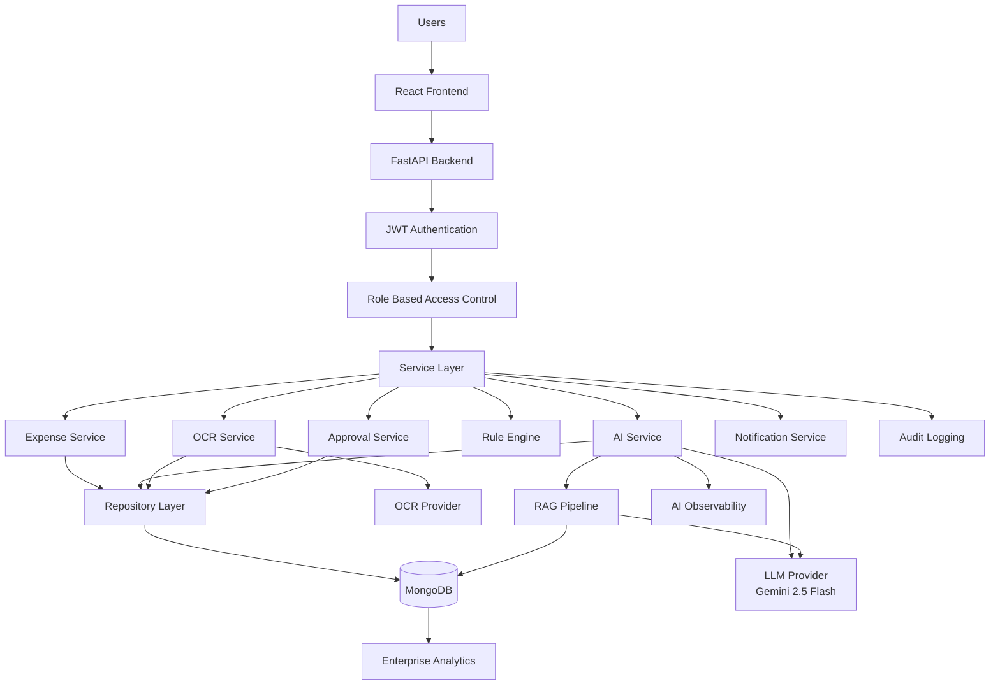
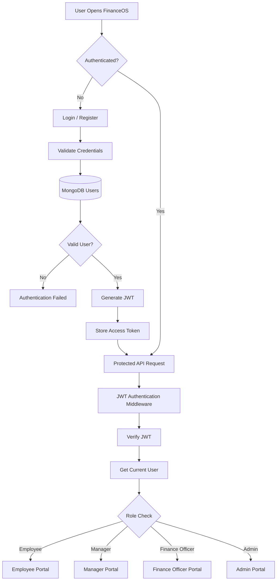
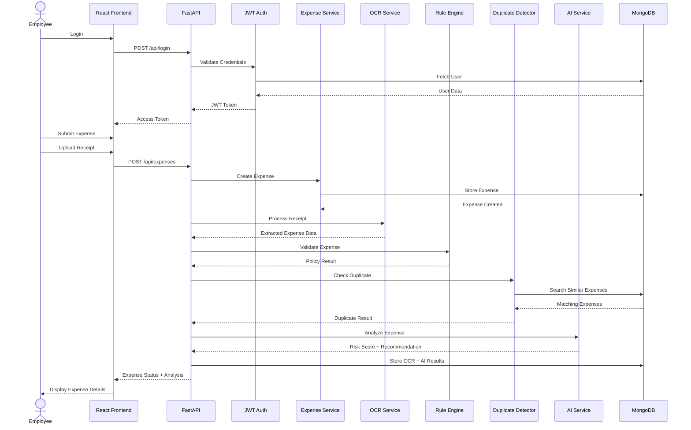
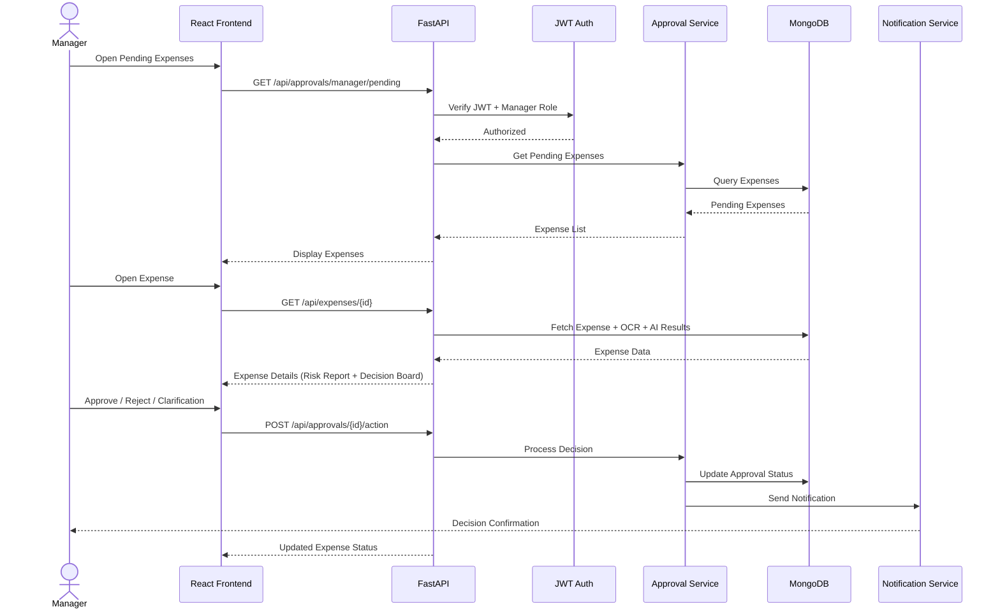
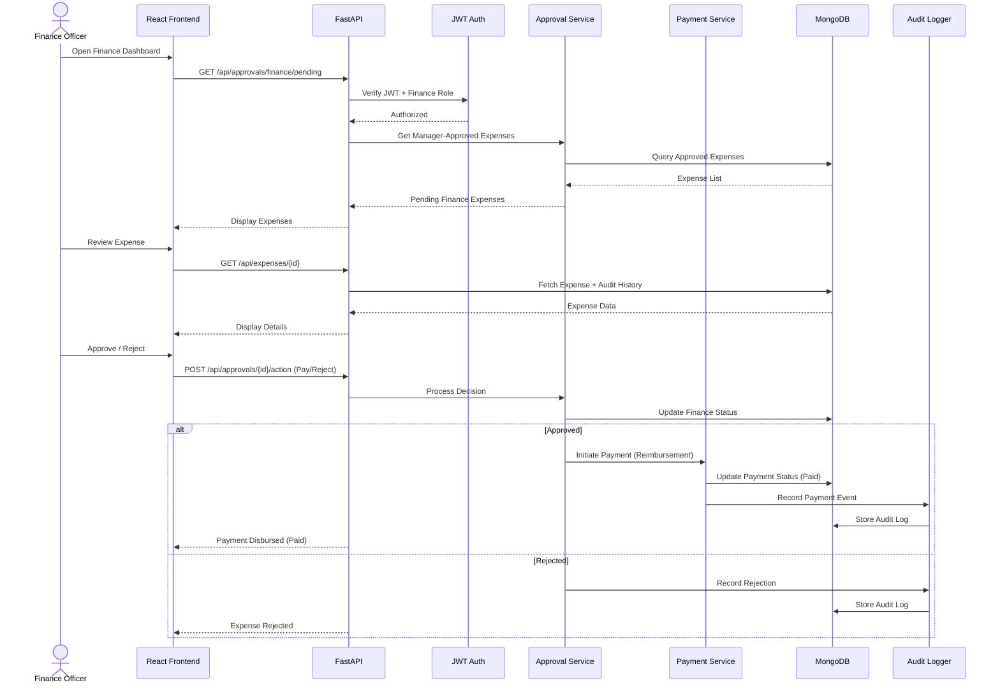
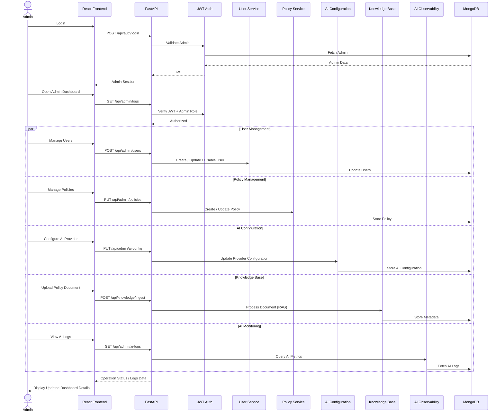
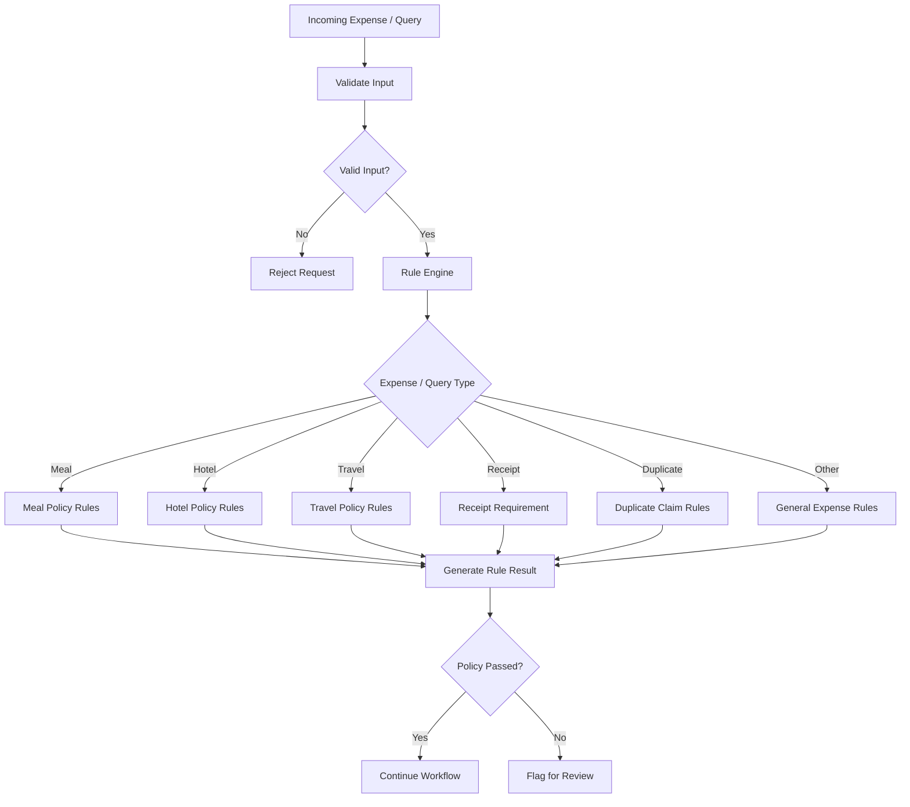
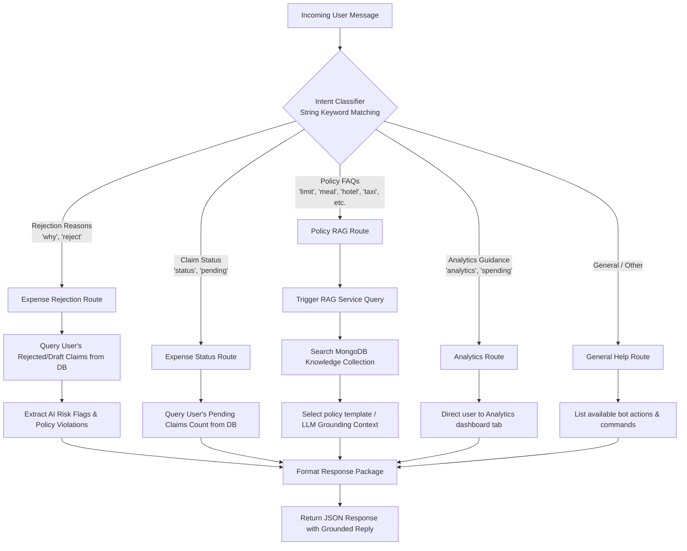
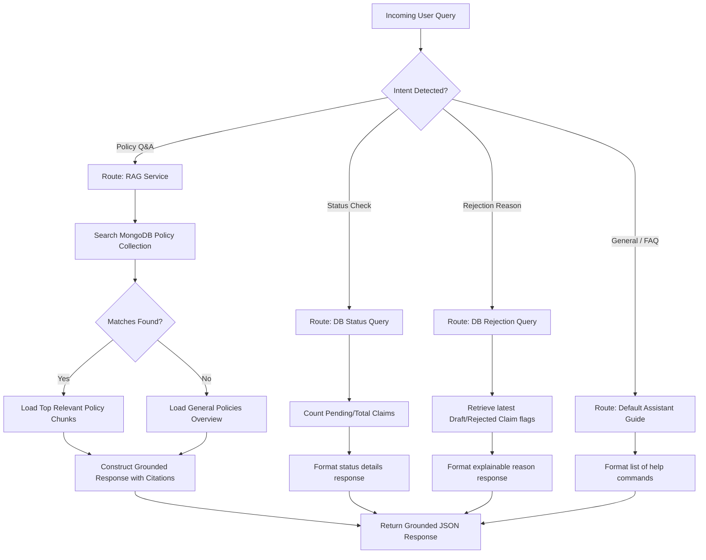
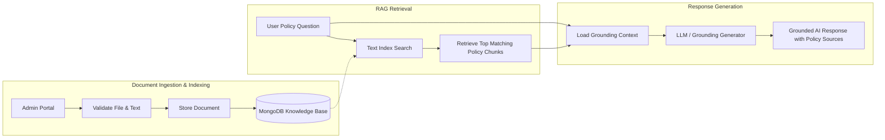

# 💼 FinanceOS – Intelligent Expense Management for the Enterprise

An intelligent expense reimbursement, policy auditing, and conversational compliance assistant powered by **FastAPI**, **React**, **Google Gemini**, **Tesseract OCR**, and **Retrieval-Augmented Generation (RAG)**, designed to provide receipt intelligence, automated compliance auditing, role-based workflows, and enterprise observability through a secure, modular backend.

---

## 📖 Table of Contents

1. [Project Overview](#-project-overview)
2. [Why FinanceOS?](#-why-financeos)
3. [Key Features](#-key-features)
4. [Technology Stack](#️-technology-stack)
5. [System Architecture](#️-system-architecture)
6. [Authentication & Authorization](#-authentication--authorization)
7. [User Workflows](#-user-workflows)
   - [Employee Workflow](#-employee-workflow)
   - [Manager Workflow](#-manager-workflow)
   - [Financial Officer Workflow](#-financial-officer-workflow)
   - [Admin Workflow](#-admin-workflow)
8. [Rule-Based Decision Engine](#-rule-based-decision-engine)
9. [AI Copilot Orchestration](#-ai-copilot-orchestration)
10. [AI Query Processing & Forced Routing](#-ai-query-processing--forced-routing)
11. [Policy Ingestion & RAG Pipeline](#-policy-ingestion--rag-pipeline)
12. [Database Architecture](#️-database-architecture)
13. [Project Structure](#-project-structure)
14. [API Endpoints](#-api-endpoints)
15. [Installation](#-installation)
16. [Configuration](#️-configuration)
17. [Running the Project](#-running-the-project)
18. [Performance](#-performance)
19. [Testing](#-testing)
20. [Future Enhancements](#-future-enhancements)
21. [License](#-license)

---

## 📌 Project Overview

Corporate expense auditing is typically a manual, error-prone, and bottlenecked process. Managers and finance staff spend hours verifying receipt line-items, cross-checking policies, checking for duplicates, and flagging non-compliant transactions. Traditional expense software only checks hard caps, failing to detect subtle anomalies or explain *why* a particular expense is problematic.

**FinanceOS** solves this problem by combining a **deterministic Rule-Based Validation Engine** with a **Generative AI Auditing Pipeline** (powered by Google Gemini) and **RAG-based conversational compliance**. 

When an employee uploads a receipt, the system parses it using Tesseract OCR, extracts key metadata, checks for policy violations and duplicate submissions locally, and triggers Gemini to produce an explainable risk report (complete with historical comparisons, fraud scores, and actionable recommendations). Furthermore, users can chat with the integrated AI Copilot to check expense limits, query policy rules, and investigate rejected claims.

---

## 💡 Why FinanceOS?

What makes FinanceOS an enterprise-grade compliance framework:

- **Decoupled Backend Architecture** — Built using a clean service-repository pattern (`Router → Service → IRepository → MongoRepository`) ensuring strict separation of concerns, easy testing, and infrastructure independence.
- **Explainable Compliance Auditing** — Instead of a raw risk score, reviewers get structured reasoning, policy citations, extracted anomalies (like alcohol items), and suggested actions.
- **Multi-Level Compliance Filters** — A deterministic Rule Engine evaluates items (e.g., meal cap limits, economy flight tickets, rideshare receipt requirements) *before* or alongside AI inference to prevent bypass issues.
- **Provider Abstraction Model** — Built with factories for LLM and OCR operations. While **Google Gemini 2.0 Flash** and **Tesseract OCR** are the operational defaults, alternative providers (like OpenAI, Claude, Groq, Azure, or Document AI) can be configured dynamically without rewriting workflows.
- **Enterprise Observability & Request Correlation** — Implements an `X-Request-ID` correlation middleware to tie frontend user sessions, API routes, database operations, and AI logs together for instant debugging.
- **Hybrid RAG & Intent Classifier** — The AI Copilot uses string-based intent routing to bypass LLMs for simple status checks, executing direct database reads and MongoDB text searches to answer policy queries.

---

## ✨ Key Features

### 🤖 AI & Automation
- **Explainable Audit Analysis** — Gemini evaluates claims against policy, outputting structured JSON with reasoning, citations, and fraud scores.
- **Tesseract OCR Engine** — Decouples text extraction from images/PDF receipts to pre-fill expense submissions.
- **Contextual AI Copilot** — Embedded chat interface providing grounded help about company reimbursements.
- **Retrieval-Augmented Generation (RAG)** — Grounded policy search querying local MongoDB knowledge collection.
- **Fallback Verification Chains** — Tier-1 API (Gemini/Groq) falls back to Tier-2 local rule-engine audit if API keys are absent or fail.

### 🔒 Security & RBAC
- **JWT Session Tokens** — Stateless, secure authorization with configurable token expiry.
- **Role-Based Access Control (RBAC)** — Route and database-level checks for Employees, Managers, Finance Officers, and Admins.
- **Hashed Credentials** — Secure password encryption using bcrypt.
- **Secure File Validation** — Upload guards enforcing extension types (PNG, JPG, PDF) and size limits.

### 📂 Configuration & Knowledge Management
- **Dynamic Policy Tuning** — Administrators can modify category limits, receipt requirements, and duplicate check windows in real-time.
- **Policy Ingestion API** — Allows admins to upload new policy handbooks and index them directly.
- **AI/OCR Configuration Dashboard** — Toggle provider settings, prompt guidelines, and models at runtime.

### 📊 Observability
- **X-Request-ID Correlation** — Middleware stamping every request with a UUID, carried across all services and database logs.
- **AI Audit Logging** — Observability collection tracking latency, prompts, responses, estimated cost, and tokens.
- **Enterprise Analytics** — Recharts-powered dashboard visualising category spend, risk profiles, and AI accuracy metrics.

---

## 🛠 Technology Stack

| Category | Technologies |
|---|---|
| **Frontend** | React, React Router, Tailwind CSS, Axios, Recharts |
| **Backend** | Python 3.11+, FastAPI, Pydantic, Motor (Async MongoDB), PyJWT |
| **Database** | MongoDB (Local / Atlas) |
| **AI / OCR Engines** | Google Gemini API (gemini-2.0-flash), Tesseract OCR |
| **Testing** | Pytest, HTTPX AsyncClient |
| **Package Manager** | uv (modern Python packaging tool) |
| **Deployment** | Docker, Uvicorn |

---

## 🏗️ System Architecture

This flowchart outlines the complete decoupled structure of FinanceOS, matching the frontend components, API gateways, repositories, and AI services.

*Standalone code file: [system_architecture.mmd](file:///c:/Users/Pratham%20arun/source/repos/Finance/docs/mermaid_diagram/system_architecture.mmd)*



---

## 🔐 Authentication & Authorization

All protected routes are guarded by FastAPI dependencies that parse, decode, and validate signed JWT bearer tokens. Passwords stored in MongoDB are encrypted using bcrypt.

*Standalone code file: [auth_flow.mmd](file:///c:/Users/Pratham%20arun/source/repos/Finance/docs/mermaid_diagram/auth_flow.mmd)*



**Access Matrix by Role:**

| Endpoint Domain | Employee | Manager | Finance Officer | Admin |
|---|---|---|---|---|
| **Submit Expense** | ✅ | ✅ | ✅ | ✅ |
| **Edit / Delete Own Drafts** | ✅ | ✅ | ✅ | ✅ |
| **Manager Approvals Queue** | ❌ | ✅ | ❌ | ✅ |
| **Finance Paid Queue** | ❌ | ❌ | ✅ | ✅ |
| **Configure System Policies** | ❌ | ❌ | ❌ | ✅ |
| **View Audit Logs** | ❌ | ❌ | ❌ | ✅ |

---

## 👤 User Workflows

### 👨‍💻 Employee Workflow
Employees scan, pre-fill, validate, and submit claims.

*Standalone code file: [employee_workflow.mmd](file:///c:/Users/Pratham%20arun/source/repos/Finance/docs/mermaid_diagram/employee_workflow.mmd)*



### 👨‍💼 Manager Workflow
Managers review incoming submissions and assess flagged violations before approving.

*Standalone code file: [manager_workflow.mmd](file:///c:/Users/Pratham%20arun/source/repos/Finance/docs/mermaid_diagram/manager_workflow.mmd)*



### 💼 Finance Officer Workflow
Finance officers manage the payment queue for manager-approved expenses.

*Standalone code file: [finance_workflow.mmd](file:///c:/Users/Pratham%20arun/source/repos/Finance/docs/mermaid_diagram/finance_workflow.mmd)*



### 🛠️ Admin Workflow
Admins configure policies, ingest regulatory text, change LLM models, and view system metrics.

*Standalone code file: [admin_workflow.mmd](file:///c:/Users/Pratham%20arun/source/repos/Finance/docs/mermaid_diagram/admin_workflow.mmd)*



---

## ⚡ Rule-Based Decision Engine

The Rule Engine operates as the core compliance layer. It analyzes each transaction against policy limits, categories, receipt states, and duplicate windows before LLM analysis.

*Standalone code file: [rule_engine.mmd](file:///c:/Users/Pratham%20arun/source/repos/Finance/docs/mermaid_diagram/rule_engine.mmd)*



**Standard Corporate Policy Rules Applied:**
- **Category Threshold Limit Check**: Meal cap limit ($50.00), Hotel cap limit ($250.00), Flight ticket cap ($1,000.00).
- **Prohibited Items Detection**: Flags keywords (e.g., `beer`, `wine`, `cocktail`, `alcohol`, `liquor`) in descriptions.
- **Future Date Check**: Expense dates in the future are flagged.
- **Receipt Validation**: Flags claims missing receipts for mandatory categories (like Accommodation and Taxi/Rideshares).
- **Grace Window submission**: Claims dated > 90 days are flagged.

---

## 🤖 AI Copilot Orchestration

The AI Copilot operates in the [`chat_service.py`](file:///c:/Users/Pratham%20arun/source/repos/Finance/backend/services/chat_service.py) service layer. It acts as an orchestrator, classifying the intent of the incoming message using string-based matching and delegating calculations, RAG lookups, or DB reads appropriately.

*Standalone code file: [ai_copilot_orchestration.mmd](file:///c:/Users/Pratham%20arun/source/repos/Finance/docs/mermaid_diagram/ai_copilot_orchestration.mmd)*



---

## 🧠 AI Query Processing & Forced Routing

To optimize latency, **Forced Routing** bypasses unnecessary LLM steps. Questions requesting status or rejected items are mapped directly to database calls, while specific policy keywords trigger immediate RAG context lookups.

*Standalone code file: [ai_query_routing.mmd](file:///c:/Users/Pratham%20arun/source/repos/Finance/docs/mermaid_diagram/ai_query_routing.mmd)*



---

## 📚 Policy Ingestion & RAG Pipeline

When an administrator uploads a policy document, it is saved, text is indexed, and it becomes searchable by the retrieval chain. When a user queries a policy, a text search is performed over the collection and top context matching chunks are supplied to Gemini to ground the response.

*Standalone code file: [rag_pipeline.mmd](file:///c:/Users/Pratham%20arun/source/repos/Finance/docs/mermaid_diagram/rag_pipeline.mmd)*



---

## 🗄️ Database Architecture

FinanceOS uses MongoDB for persistent collections. The repository layer interfaces Motor (an asynchronous MongoDB driver) with the services layer.

### Primary Collections:

| Collection | Schema Focus | Index Strategy |
|---|---|---|
| `users` | `_id`, `email`, `password_hash`, `role`, `manager_id` | Unique Text index on `email` |
| `expenses` | `_id`, `employee_id`, `title`, `amount`, `category`, `status`, `receipt_url`, `ocr_data`, `risk_score`, `risk_flags`, `ai_analysis` | Compound index on `employee_id` + `status` |
| `policies` | `_id`, `category`, `max_limit`, `receipt_required`, `duplicate_window` | Unique key index on `category` |
| `notifications` | `_id`, `user_id`, `message`, `is_read`, `created_at` | Index on `user_id` + `is_read` |
| `ai_logs` | `_id`, `request_id`, `expense_id`, `user_id`, `model`, `prompt`, `response`, `latency_ms`, `tokens`, `errors` | Index on `expense_id` and `request_id` |
| `knowledge` | `_id`, `title`, `category`, `content` | Text search index on `content` |

---

## 📁 Project Structure

```text
FinanceOS/
│
├── backend/                       # Python FastAPI Backend
│   ├── app.py                     # Main FastAPI application bootstrapping
│   ├── server.py                  # Core backend entrypoint wrapper
│   │
│   ├── core/                      # Global systems and middlewares
│   │   ├── config.py              # Environment configuration loader
│   │   ├── security.py            # Password hashing and JWT utilities
│   │   ├── lifespan.py            # Application startup and shutdown lifetime events
│   │   ├── middleware.py          # Request Correlation ID (X-Request-ID) & CORS configuration
│   │   ├── logging.py             # Structured JSON logging initialization
│   │   └── exceptions.py          # Custom HTTP exception Handlers
│   │
│   ├── dependencies/              # Dependency injection providers
│   │   └── auth.py                # JWT verification and user retrieval checks
│   │
│   ├── routers/                   # HTTP Route handlers
│   │   ├── auth_router.py         # Login, Registration, JWT profile retrieval
│   │   ├── expense_router.py      # Creation, upload, detail fetches, timelines
│   │   ├── approval_router.py     # Approval actions (Approve, Reject, Clarify)
│   │   ├── notification_router.py # Notification queues and read status
│   │   ├── analytics_router.py    # Enterprise financial and accuracy KPI endpoints
│   │   ├── ai_router.py           # Conversational AI Copilot chat
│   │   ├── knowledge_router.py    # Policy database search and ingestion
│   │   └── admin_router.py        # System policies, AI/OCR config dashboard
│   │
│   ├── services/                  # Business logic services
│   │   ├── auth_service.py        # Authentication logic orchestrator
│   │   ├── expense_service.py     # Expense lifecycle flows and state handlers
│   │   ├── notification_service.py# In-app notifications router
│   │   ├── analytics_service.py   # Chart aggregations and spending calculations
│   │   ├── ai_service.py          # AI Audit Prompt builder and Fallback pipeline
│   │   ├── rule_engine.py         # Deterministic policy validation engine
│   │   ├── admin_service.py       # Administration settings CRUD
│   │   ├── ocr_service.py         # OCR file validation and Tesseract wrapper
│   │   ├── chat_service.py        # AI Copilot keyword and RAG router
│   │   ├── rag_service.py         # Grounded prompt and search generator
│   │   ├── gemini_service.py      # Google Gemini 2.0 Flash integration
│   │   └── groq_service.py        # Optional Groq provider fallback
│   │
│   ├── repositories/              # DAO persistence layer (Repository Pattern)
│   │   ├── interfaces/            # Abstract base interfaces
│   │   │   └── base.py
│   │   ├── user_repository.py     # Users DB queries
│   │   ├── expense_repository.py  # Expenses DB queries
│   │   ├── policy_repository.py   # Policy limits DB queries
│   │   ├── ai_logs_repository.py  # AI logs DB queries
│   │   └── knowledge_repository.py# Grounding handbook DB queries
│   │
│   ├── schemas/                   # Pydantic validation schemas
│   ├── seed/                      # Initial seeding datasets
│   ├── tests/                     # Pytest testing suite
│   └── uploads/                   # Temporary filesystem upload store
│
├── frontend/                      # React SPA Frontend
│   ├── public/                    # Static assets
│   ├── src/                       # Application code
│   │   ├── components/            # Reusable UI parts (dashboard, risk panels)
│   │   ├── context/               # Global state (Auth, Notification Context)
│   │   ├── pages/                 # Authenticated route components
│   │   └── App.js                 # Frontend routing configuration
│   ├── package.json               # Frontend dependencies list
│   └── tailwind.config.js         # CSS configuration files
│
├── docs/                          # Project documentation
│   ├── mermaid_diagram/           # Standalone Mermaid diagrams (.mmd)
│   └── system_architecture.md     # System architecture specification
│
├── .gitignore
├── README.md                      # Project manual
└── PROJECT_STATUS.md              # Sprint status tracker
```

---

## 🔌 API Endpoints

### 🔐 Authentication

| Method | Endpoint | Description | Auth Scope |
|---|---|---|---|
| `POST` | `/api/auth/register` | Register new user. Auto-assigns reporting manager. | Public |
| `POST` | `/api/auth/login` | Validate credentials, returns JWT bearer token. | Public |
| `GET` | `/api/auth/me` | Fetch active user session information. | Authenticated |

### 💵 Expenses

| Method | Endpoint | Description | Auth Scope |
|---|---|---|---|
| `POST` | `/api/expenses/upload` | Validates and processes receipt file using Tesseract. | Authenticated |
| `POST` | `/api/expenses` | Submit new expense claim. Rules are checked instantly. | Authenticated |
| `GET` | `/api/expenses` | Retrieves paginated expenses based on role-scope. | Authenticated |
| `GET` | `/api/expenses/{id}` | Returns complete expense metadata, history, and AI report. | Authenticated |
| `PUT` | `/api/expenses/{id}` | Updates draft claims. | Authenticated |
| `DELETE` | `/api/expenses/{id}` | Deletes draft or rejected claims. | Authenticated |
| `GET` | `/api/expenses/{id}/timeline` | Returns approval audit log history. | Authenticated |

### 👥 Approvals & Actions

| Method | Endpoint | Description | Auth Scope |
|---|---|---|---|
| `POST` | `/api/approvals/{id}/action` | Take action on claim (Approve / Reject / Clarification). | Manager / Finance |

### 🤖 AI, Copilot, & RAG

| Method | Endpoint | Description | Auth Scope |
|---|---|---|---|
| `POST` | `/api/ai/chat` | Send query to AI Copilot. Classifies intent and returns grounded reply. | Authenticated |
| `POST` | `/api/knowledge/ingest` | Ingest compliance files into knowledge collection. | Admin / Finance |
| `GET` | `/api/knowledge/search` | Search policy handbook collection directly. | Authenticated |

### 🛠️ Administration & Settings

| Method | Endpoint | Description | Auth Scope |
|---|---|---|---|
| `GET` | `/api/admin/policies` | List active policy limit rules. | Authenticated |
| `PUT` | `/api/admin/policies` | Update category limits, duplicate windows. | Admin |
| `GET` | `/api/admin/ai-config` | View active LLM configuration settings. | Authenticated |
| `PUT` | `/api/admin/ai-config` | Modify LLM models or prompt guidelines. | Admin |
| `GET` | `/api/admin/ai-config/metrics` | Returns live AI logs usage statistics and performance. | Admin |
| `GET` | `/api/audit/ai-logs` | Retrieve detailed correlation logs for audit reviews. | Admin |

---

## 🚀 Installation

### Prerequisites

1. **Python 3.11+** installed.
2. **Node.js 18+** & npm installed.
3. **MongoDB** instance running locally (`mongodb://localhost:27017`) or Atlas URI.
4. **Tesseract OCR Engine** installed locally:
   - *Windows*: Install via standard binary, then add it to PATH or set `TESSERACT_CMD` environment variable.
   - *macOS*: Install via Homebrew `brew install tesseract`.
   - *Linux*: Install via APT `sudo apt install tesseract-ocr`.

### Backend Installation

```bash
# Clone the repository
git clone https://github.com/Pratham-Arun/FinanceOS.git
cd FinanceOS/backend

# Create virtual environment and install dependencies using uv
pip install uv
uv sync

# Copy env example and update keys
cp .env.example .env
```

### Frontend Installation

```bash
cd ../frontend
npm install
```

---

## ⚙️ Configuration

Create a `.env` file inside the `backend/` directory:

```env
# MongoDB Connection Config
MONGO_URI=mongodb://localhost:27017
MONGO_DB_NAME=expense_reimbursement

# Security Config (Generate a secure key with secrets.token_hex(32))
JWT_SECRET=financeos_demo_jwt_secret_key_2026_secure
ACCESS_TOKEN_EXPIRE_MINUTES=1440

# LLM Providers Configuration (Required for active LLM features)
GEMINI_API_KEY=your_gemini_api_key_here
GEMINI_MODEL=gemini-2.0-flash

# Optional Providers
GROQ_API_KEY=your_groq_api_key_here
GROQ_MODEL=llama-3.3-70b-versatile
OPENAI_API_KEY=your_openai_api_key_here

# OCR Engine Path (Windows users must specify full path if not on system PATH)
TESSERACT_CMD=C:\Program Files\Tesseract-OCR\tesseract.exe
```

---

## ▶️ Running the Project

### 1. Start Backend

```bash
cd backend
uv run uvicorn app:app --reload --host 0.0.0.0 --port 8000
```
- API Base Url: `http://localhost:8000`
- Swagger UI Documentation: `http://localhost:8000/docs`

### 2. Start Frontend

```bash
cd frontend
npm start
```
- Frontend Local URL: `http://localhost:3000`

### 👤 Demo Seed Accounts

The application automatically seeds the following credentials on startup:

| Role | Email | Password |
|---|---|---|
| **Admin** | `admin@demo.com` | `admin123` |
| **Employee** | `employee@demo.com` | `demo1234` |
| **Manager** | `manager@demo.com` | `demo1234` |
| **Finance Officer** | `finance@demo.com` | `demo1234` |

---

## 📊 Performance & Observability

### Latency Profiles:
- **Rule Engine Policy Validation**: **< 1 ms** (Executed locally on request)
- **Tesseract OCR parsing**: **~400 ms - 800 ms** (Based on receipt resolution)
- **Gemini API Call (Analysis Prompt)**: **~1.8 s - 2.5 s**
- **AI Copilot intent-route response**:
  - DB status query bypass: **~5 ms**
  - RAG Policy query response: **~2.2 s**

### 🔎 Observability Log Entry Sample:

```json
{
  "request_id": "9b1deb4d-3b7d-4bad-9bdd-2b0d7b3dcb6d",
  "expense_id": "exp_67c1b5a2f57a0",
  "user_id": "user_67c1b5a1f57a9",
  "event_type": "AI_ANALYSIS",
  "model": "gemini-2.0-flash",
  "latency_ms": 2154,
  "tokens": {
    "prompt_tokens": 820,
    "completion_tokens": 180
  },
  "status": "SUCCESS"
}
```

---

## 🧪 Testing

FinanceOS includes automated verification testing across API router and AI service modules:

Run pytest command suite:
```bash
cd backend
uv run pytest
```

The test files cover:
- **Authentication Router**: Correct JWT encoding, token verification, unauthorized access blocks.
- **Expense Router**: Receipt upload logic, CRUD boundaries, role-based filtration.
- **Rule Engine Service**: Category limit violation flags, prohibited keyword (alcohol) detection, receipt requirements.
- **AI Endpoints & Fallback**: Observability logs write checks, fallback response shape alignment.

---

## 🚀 Future Enhancements

- **Cloud Deployment & Containers**: Complete Docker-compose wrapper for local multi-container and staging deployment.
- **CI/CD Pipelines**: Automated pull request checks, linting, and API integration testing.
- **Real-Time Notification Sockets**: WebSocket integration for instant approval alerts to employees.
- **ERP Integration**: Export paid claims directly to SAP or NetSuite ledgers.
- **Document AI Upgrade**: Optional switch to cloud document processing services for complex invoices.

---

## 👥 Contributors

- **Pratham Arun** — Architecture, Backend, AI Pipelines, React Frontend
  - [GitHub Profile](https://github.com/Pratham-Arun)

---

## 📄 License

This project is licensed under the terms of the MIT License.

---

> **Financial Disclaimer:** FinanceOS is a compliance automation assistant designed to streamline corporate reimbursement review. It does not replace legal, financial audit, or official accounting procedures. Always verify claims against official local tax laws.

<div align="center">

**FinanceOS**  
*Intelligent Expense Management for the Enterprise*  
**Automate. Analyze. Explain. Approve.**

</div>
