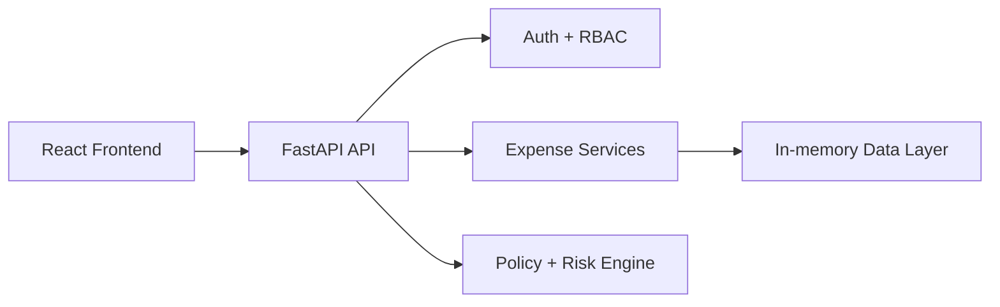

# FinanceOS

FinanceOS is a demo-ready enterprise expense reimbursement platform built with FastAPI and React. The app models an AI-assisted finance workflow where employees submit expenses, managers review claims, finance teams approve payments, and administrators manage policy rules.

This repository is currently structured as a local development prototype with a working backend/frontend flow, demo role accounts, and an in-memory data layer for quick testing.

## Highlights

- AI-style expense intake workflow with upload, OCR-style parsing, and risk scoring
- Role-based approval pipeline across Employee, Manager, Finance, and Admin
- Dashboard and analytics views for operational visibility
- FastAPI backend with JWT authentication and policy enforcement
- React frontend for a single-page reimbursement experience

## Current Project Status

The application is functional for local testing, but it is not yet production-hardened. Current implementation notes:

- Backend APIs are implemented and working in local development mode
- Demo authentication is available for test roles
- Expense data is currently stored in memory rather than a production database
- OCR is mocked for demo behavior rather than connected to a real document extraction engine

## Architecture



## Tech Stack

### Backend
- Python 3.11+
- FastAPI
- PyJWT
- Pydantic
- Python-dotenv
- pytest

### Frontend
- React 18
- React Router
- Vanilla CSS styling
- API-driven UI state

## Repository Structure

- `backend/` — FastAPI application, auth, expense APIs, services, and tests
- `frontend/` — React application and UI assets
- `docs/` — project requirements, architecture, testing, deployment documentation
- `memory/` — demo credential reference notes

## Getting Started

### Prerequisites

- Python 3.11+
- Node.js 18+
- npm
- Optional: `uv` for backend dependency management

### 1. Backend setup

```bash
cd backend
python -m venv .venv
source .venv/bin/activate
pip install -r requirements.txt
uvicorn server:app --reload --port 8000
```

If you are using `uv`, you can also do:

```bash
cd backend
uv sync
uv run uvicorn server:app --reload --port 8000
```

The API docs are available at:

- http://localhost:8000/docs

### 2. Frontend setup

```bash
cd frontend
npm install
npm start
```

The frontend will typically run at:

- http://localhost:3000

## Demo Credentials

The app ships with built-in demo accounts for quick local testing:

| Role | Email | Password |
|---|---|---|
| Employee | `employee@demo.com` | `demo1234` |
| Manager | `manager@demo.com` | `demo1234` |
| Finance | `finance@demo.com` | `demo1234` |
| Admin | `admin@demo.com` | `admin123` |

## Running Tests

```bash
cd backend
pytest
```

## Environment & Secrets

Do not commit secrets or local environment files to Git. The repository already ignores `.env` files at the root and under `backend/`.

Use `.env.example` as the template for any local configuration you need, and keep real credentials out of version control.

## Notes

This project is intended as a demonstrator and local development workspace. It is a strong starting point for a full expense automation product, but production deployment, persistent database integration, and real OCR/LLM processing still need to be wired in.

## License

This repository is shared for demo and development purposes. Review the project docs and add an explicit license before distributing it beyond internal or educational use.
