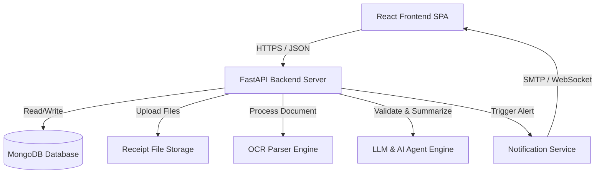
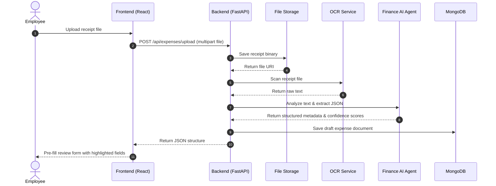
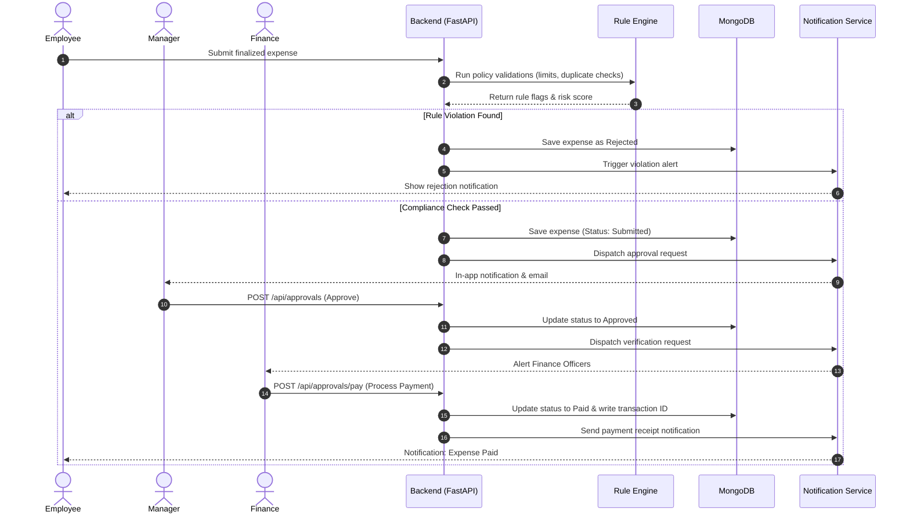

# 03. System Architecture

This document describes the high-level architecture, subsystem interactions, and core workflows of the AI-powered Expense Reimbursement Automation system.

---

## 1. High-Level Architecture

The system uses a decoupled, service-oriented architecture comprising a single-page React frontend, a FastAPI backend, an AI processing pipeline (OCR + LLM), a MongoDB database, and file storage.

---

## 2. Component Descriptions

### 2.1 React Frontend
* **Core Framework**: React (Single Page Application).
* **State Management**: React Context API for global state (Auth, Notifications) and local component state for forms/filters.
* **Network Client**: Axios for HTTP communication with backend API endpoints.

### 2.2 FastAPI Backend
* **ASGI Framework**: Python FastAPI serving as the central API gateway.
* **Routing Layer**: Modular routers divided by concern (`auth`, `expenses`, `approvals`, `policies`, `analytics`).
* **Service Layer**: Business logic coordinator (encapsulates workflow rules, routes to AI, triggers notifications).
* **Repository Layer**: Data Access Object (DAO) pattern interacting with MongoDB.

### 2.3 AI Services
* **OCR Parser**: Extracts raw text blocks and coordinates from uploaded receipt images/PDFs.
* **LLM Engine**: Extracts structured JSON metadata from the raw OCR text blocks (Vendor, Invoice Number, Amount, Tax, Date).
* **Finance AI Agent**: Evaluates the submission, compares values with the Policy Knowledge Base, performs risk checks, and generates a compliance assessment.

### 2.4 Data & Storage Layer
* **MongoDB**: NoSQL database storing JSON collections for users, expenses, policies, notifications, and logs.
* **File Storage**: Local filesystem path (development) or S3 bucket (production) storing binary receipt uploads.

---

## 3. Core Workflow Sequence Diagrams

### 3.1 Expense Submission Flow
This workflow traces the submission of a receipt by an employee, from upload to pre-filled review.

### 3.2 Approval & Validation Flow
This workflow describes the validation checks and routing path for Manager and Finance review.

