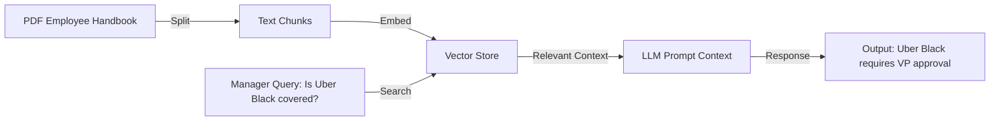

# 05. AI Module Documentation

This document describes the AI systems integrated within the application: the Optical Character Recognition (OCR) scanner, the Rule Engine, the RAG (Retrieval-Augmented Generation) policy helper, and the Finance AI Agent.

---

## 1. OCR Document Pipeline

The OCR pipeline converts raw images or PDF uploads into normalized text data, structured for LLM extraction.

```
┌──────────────┐      ┌─────────────┐      ┌──────────────┐      ┌─────────────┐
│ Uploaded File│ ───> │ Preprocess  │ ───> │ OCR Engine   │ ───> │ Raw Text    │
│ (Image/PDF)  │      │ (Grayscale) │      │ (Tesseract)  │      │ Block Output│
└──────────────┘      └─────────────┘      └──────────────┘      └─────────────┘
```

1. **Pre-processing**: Uploaded files (JPEG, PNG, PDF) are normalized. Images are converted to grayscale and thresholded using OpenCV to maximize text contrast.
2. **Text Scanning**: The system passes the clean image to the OCR module (e.g., Tesseract OCR or Google Cloud Document AI).
3. **Output Generation**: The engine returns a raw text block preserving line layouts.

---

## 2. Rule Engine Architecture

The Rule Engine operates sequentially on the extracted JSON metadata *prior* to LLM analysis. This reduces LLM token overhead and guarantees instant validation for hard business limits.

### 2.1 Core Validation Rules
* **Limit Check**: Verifies if `amount` exceeds the policy threshold for the selected `category`.
* **Duplicate Detection**: Searches MongoDB for pre-existing records matching:
  $$\text{Duplicate Match} = (\text{vendor} \approx \text{existing\_vendor}) \land (\text{amount} = \text{existing\_amount}) \land (\text{date} = \text{existing\_date})$$
  within a 30-day submission window.
* **Format Checks**: Confirms standard receipt formats (e.g., invoice numbers must contain alphanumeric characters; GST numbers must follow standard patterns if applicable).

---

## 3. Finance AI Agent & Prompt Design

The Finance AI Agent processes the raw OCR text blocks to construct a clean JSON output, evaluate category validity, and run risk classifications.

### 3.1 LLM Extraction Prompt (System Prompt)
```
You are an expert financial OCR auditor. Your task is to extract structural invoice metadata from the raw, unstructured text block scanned from a receipt.

You must output a valid JSON object matching this schema. Do not output conversational text or markdown wrappers outside the JSON block.

JSON Schema:
{
  "vendor": "String (Merchant name, clean up corporate suffixes like Inc or LLC)",
  "invoice_number": "String (Invoice/Receipt number. If not found, use null)",
  "amount": "Number (Total amount paid. If multiple totals, select the final balance)",
  "expense_date": "String (ISO-8601 format YYYY-MM-DD. Normalize all dates here)",
  "gst_details": "String (GST/VAT number if visible, else null)"
}
```

### 3.2 Few-Shot Extraction Example
* **User OCR Input**:
  ```
  * STARBUCKS #11029 *
  120 MAIN STREET, AUSTIN, TX
  DATE: 07/15/2026 08:31 AM
  TKT# 88921-2
  1x LATTE  $5.50
  1x CROISSANT $4.50
  SUBTOTAL: $10.00
  TAX 8.25%: $0.83
  TOTAL PAID: $10.83
  THANK YOU!
  ```
* **AI Agent JSON Response**:
  ```json
  {
    "vendor": "Starbucks",
    "invoice_number": "88921-2",
    "amount": 10.83,
    "expense_date": "2026-07-15",
    "gst_details": null
  }
  ```

---

## 4. Policy RAG Helper

The system implements a local Retrieval-Augmented Generation (RAG) module to assist managers and finance teams in resolving ambiguous claims against the corporate travel and expense handbook.



### 4.1 RAG Architecture
* **Ingestion**: The system chunks the company's PDF travel and expense policy handbook (e.g., 200-word chunks with 50-word overlaps).
* **Embeddings**: Text chunks are converted into dense vector representations using a model like `text-embedding-3-small`.
* **Vector Store**: Embeddings are stored in a database (e.g., Pinecone, Chroma, or MongoDB Vector Search).
* **Retrieval & Verification**: When an expense is flagged as borderline (e.g., "Weekend dinner expense"), the AI agent queries the vector store for the corresponding policy segment and appends it to the manager's review panel.
